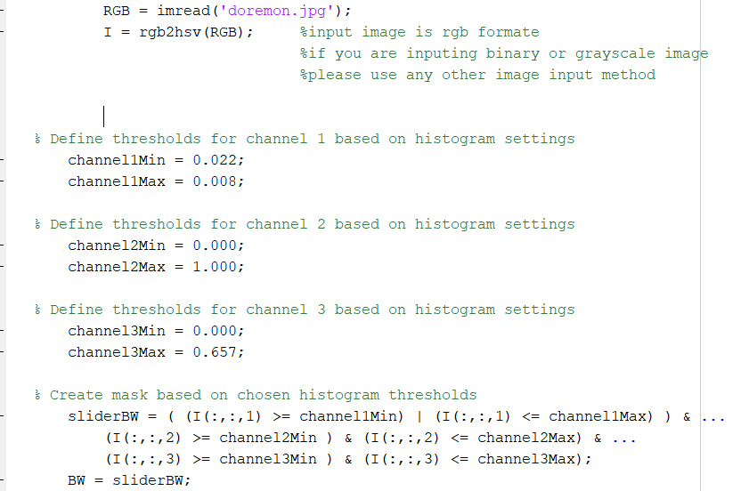

# drawing-robot-in-V-REP

Drawing Robot in V-REP with help of MATLAB (for Image processing)

NOTE-

      1.Before starting anything remApi.m ,remoteApiProto.m ,the appropriate remote API library: "remoteApi.dll" (Windows) are on same folder where matlab code is placed.
      2.Check connection of V-rep with matlab by opening any of the scene, stating simulation and running simpleTest.m in matlab to check matlab-vrep are connected or not.

How to run simulation-
             
            Makesure matlab file code.m and image doremon.jpg are on same folder
            (if you want to input any other image makesure its in rgb formate (colour image) and it should be in the same folder)
            1.Firstly start V-rep scene drawing.ttt
            2.Than run matlab file code.m 

Understand MATLAB code-

This part of code is just to convert input image to binary 
note that input image is a colour image if you are having binary image than you can directly calculate boundries 

Using simple 3D plot method motion trajectory is generated. 
z=0 when lines (x and y value) are continuous means it will draw in paper till lines are continuous
if lines are not continous than z=30 its means it will pick up its hand than move to point where line are continious 
Its exactly the way a human draws

its just the scale factor to adjust robot arm such that it draws within the page
